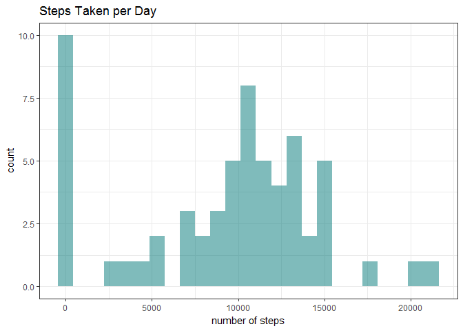
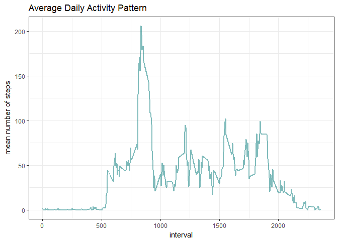
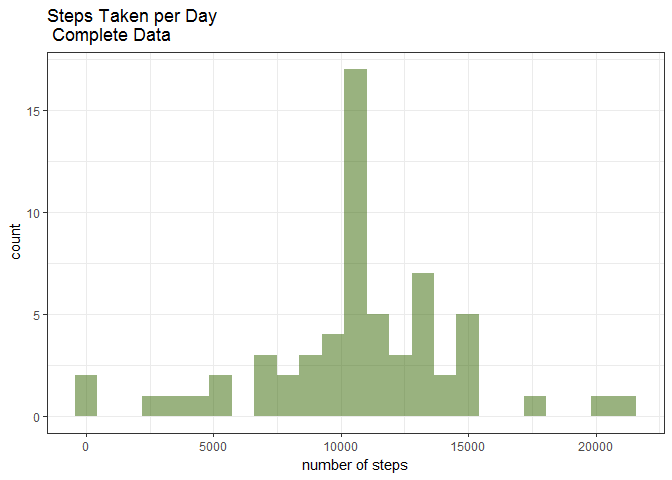
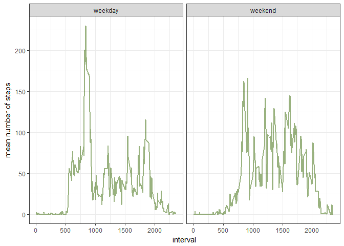

# Reproducible Research Course Project 1
Ashley Wood  
February 6, 2017  


This document uses the data collected from activity monitoring devices such as Fitbit, Nike Fuelband, and Jawbone Up. The device collected data at 5-minute intervals throughout the day over two months (October and November 2012). The variables in the data frame are:

```steps``` : the number of steps taken in the 5-minute interval

```date``` : the date of the measurement in YYYY-MM-DD format

```interval``` : identifier of 5 minute interval in which the measurement was taken. 


There are 17,568 observations in total.


####Load the data set, and preview the first few rows. 

- Also load necessary packages


```r
stepdata <- read.csv("activity.csv")

#change date column from factor to Date class
stepdata$date <- as.Date(stepdata$date)

library(dplyr) #to use functions summarize() and group_by()
library(ggplot2) #ggplot graphing capabilities
library(lubridate) #function wday()
library(magrittr) #for pipe operator %>%

head(stepdata, 5)
```

```
##   steps       date interval
## 1    NA 2012-10-01        0
## 2    NA 2012-10-01        5
## 3    NA 2012-10-01       10
## 4    NA 2012-10-01       15
## 5    NA 2012-10-01       20
```


####Create a histogram of steps taken per day and calculate the mean and median.

```r
daily_steps <-
  as.data.frame(summarize(group_by(stepdata, date), sum = sum(steps, na.rm =
                                                             T)))

h <- ggplot(daily_steps, aes(sum))
h + geom_histogram(fill = "#007777", alpha = 0.5, bins = 25) + theme_bw() + labs(x = "number of steps", title = "Steps Taken per Day")
```

<!-- -->

```r
print(paste0(
  "The mean number of steps taken per day is ",
  round(mean(daily_steps$sum, na.rm = TRUE), 1),
  ". The median is ",
  round(median(daily_steps$sum, na.rm = TRUE), 1),
  "."
))
```

```
## [1] "The mean number of steps taken per day is 9354.2. The median is 10395."
```


####Create a line graph showing the daily activity pattern

- Average number of steps taken across each five minute interval across all days


```r
interval_steps <-
  as.data.frame(summarize(group_by(stepdata, interval), mean = mean(steps, na.rm =
                                                                   T)))

lg <- ggplot(interval_steps, aes(x = interval, y = mean))
lg + geom_line(color = "#007777",
               size = 1,
               alpha = 0.5) + theme_bw() + labs(y = "mean number of steps", title = "Average Daily Activity Pattern")
```

<!-- -->

```r
print(
  paste0(
    "On average, the 5 minute interval that contains the most steps is the interval beginning at ",
    interval_steps$interval[which.max(interval_steps$mean)],
    "."
  )
)
```

```
## [1] "On average, the 5 minute interval that contains the most steps is the interval beginning at 835."
```


####Imputing missing values

```r
print(paste0("There are a total of ", length(which(is.na(stepdata$steps))), " missing values in the data."))
```

```
## [1] "There are a total of 2304 missing values in the data."
```

```r
#fill in missing values with mean of the 5-minute interval
stepscomp <- stepdata

for (i in which(is.na(stepscomp$steps))){
  stepscomp$steps[i] <- interval_steps$mean[interval_steps$interval == stepscomp$interval[i]]
}


#histogram of total number of steps taken per day, complete data

daily_steps_comp <-
  as.data.frame(summarize(group_by(stepscomp, date), sum = sum(steps, na.rm =
                                                             T)))

h1 <- ggplot(daily_steps_comp, aes(sum))
h1 + geom_histogram(fill = "#336600", alpha = 0.5, bins = 25) + theme_bw() + labs(x = "number of steps", title = "Steps Taken per Day \n Complete Data")
```

<!-- -->

```r
print(paste0("With the missing data completed, the mean steps per day is ", round(mean(daily_steps_comp$sum, na.rm = TRUE), 1), ", and the median is ", round(median(daily_steps_comp$sum, na.rm = TRUE), 1),"."))
```

```
## [1] "With the missing data completed, the mean steps per day is 10766.2, and the median is 10766.2."
```


Clearly, when the missing value were replaced with the mean number of steps for the corresponding 5 minute interval, both the mean and the median increased (and they are almost equal). 


####Patterns in weekdays vs. weekends


```r
#create new column in stepscomp data frame to decided whether the date is a weekday or weekend

stepscomp$day <- as.character("weekday")
stepscomp$day[which(wday(stepscomp$date) %in% c(1,7))] <- "weekend"
stepscomp$day <- as.factor(stepscomp$day)

interval_steps_wday <- 
  stepscomp %>%
  group_by(day,interval) %>%
  summarize(mean = mean(steps)) %>%
  as.data.frame()

wdp <- ggplot(interval_steps_wday, aes(interval, mean))
wdp + geom_line(color = "#336600", size = 0.75, alpha = 0.5) + facet_wrap(~day) + theme_bw() +labs(y = "mean number of steps", main = "Daily Activity Pattern \n Weekday vs. Weekend")
```

<!-- -->
